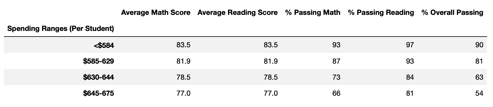

# Overview of School District Analysis
The intent of this analysis was to provide a variety of views of school performance data by different attributes including school type, size, and spending.  In addition, performance was also broken out by grade level.  The original data set was also modified to remove 9th graders at Thomas High Shchool, due to suspected academic dishonesty.

## School District Analysis Results

### School District Summary Comparison

Below is a comparison of the original district summary vs. the updated summary after Thomas High School 9th graders were removed:

#### School District Summary: Orginal

#### School District Summary: Revised

While the total schools, students, and budget remainded the same, there were slight changes to the Average Math Score (-0.1), % Passing Math (-.02), % Passing Reading (-0.3), and % Overall Passing (-0.1).  

### School Summary Comparison

The school summary was only affected for Thomas High School, as shown below:

#### THS Summary: Original

#### THS Summary: Revised

The scores remained very similar across both versions of THS summary data.  There was a mixture of changes when removing the Thomas High ninth graders.  The Math scores went down slightly in terms of Average and % Passing.  However, the Reading scores actually went up in terms of Average score.     

Replacing the ninth graders' math and reading scores has not impacted Thomas High School in relation to its peer schools.  It still ranks as the number 2 high school in terms of Overall Passing in the district.  

### Math and Reading Scores by Grade

Since the results were broken out by school prior to being cut by grade level, the results for Math and Reading scores remains the same.  The only exception is that the 9th grader scores for both Math and Reading at Thomas High School were entirely removed and replaced by "NaN".  

### Scores by School Spending

There were no changes between the original and revised summaries by school spending levels.  The table from the updated data set is shown below, but matches exactly with the original data set results.

#### Spending Summary

### Scores by School Size

Again, no differences were observed between the original and revised data sets.  The revised data set results are shown below.  

#### Size Summary

### Scores by School Type

Both versions matched in terms of school type summaries.  The updated data set, with Thomas High ninth graders removed, is shown below.     

#### Type Summary

## Summary

There was not a significant impact to Reading and Math scores at Thomas High School when the 9th graders were removed from the data set.  However, it was interesting that the removal slightly brought down the Math scores, but more significanly raised the Reading scores (although all changes were within 0.5 points).  Also, that impact was diminished even further as you looked at the broader range of schools across the district.  The summaries looked the same as you rolled the slightly revised data into a much larger group.  

The largest impacts seemed to be:

1. Thomas High School Math scores dropped slighty, with % Passing Math going from 93.27 to 93.19.
1. Average Reading scores at Thomas High School actually went up, going from 83.84 to 83.90
1. Overall Passing Rate at Thomas High School decreased from 90.94 to 90.63.
1. For the entire district, Overall Passing Rate dipped from 65 to 64.9.